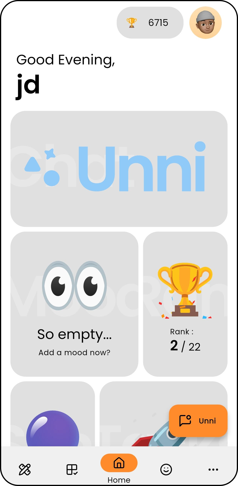
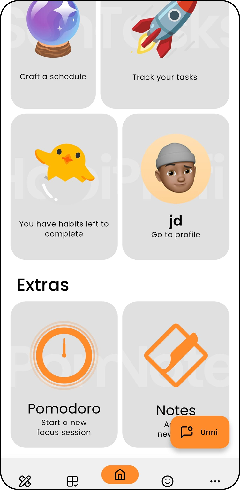
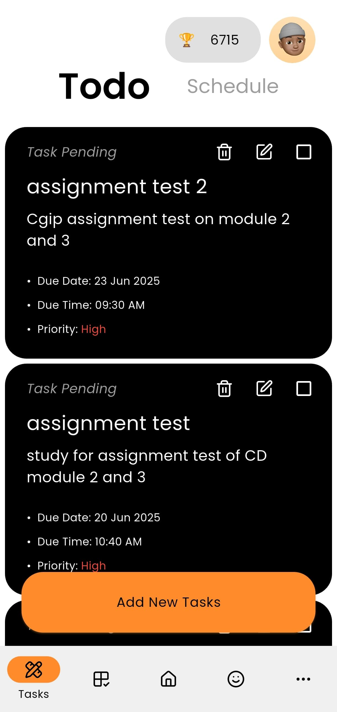
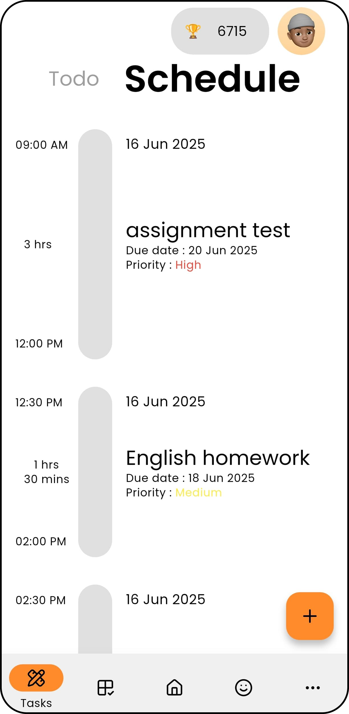
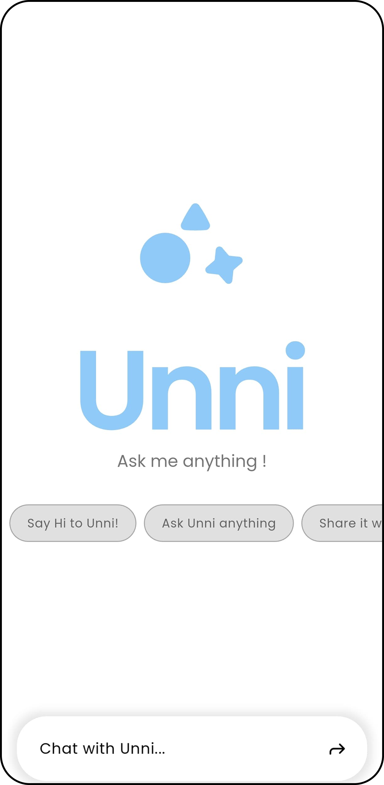
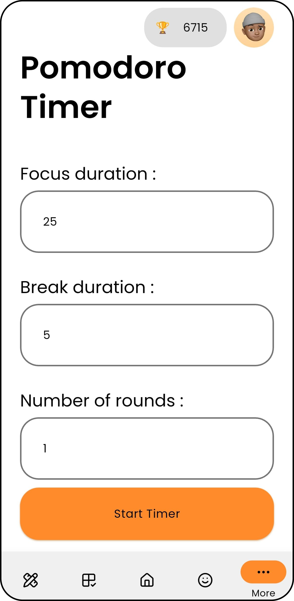
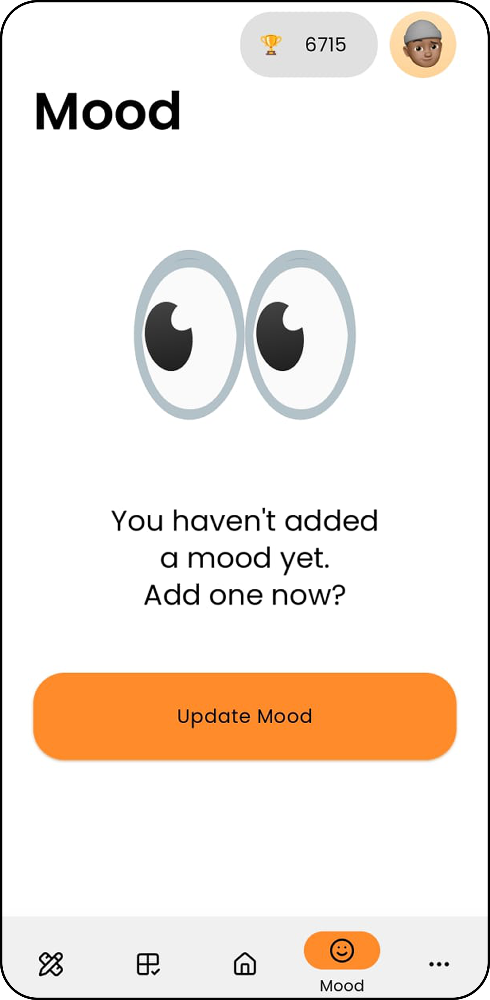
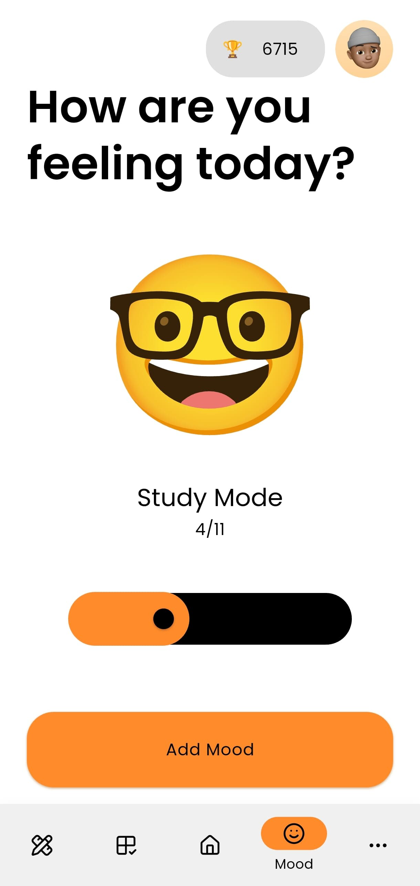
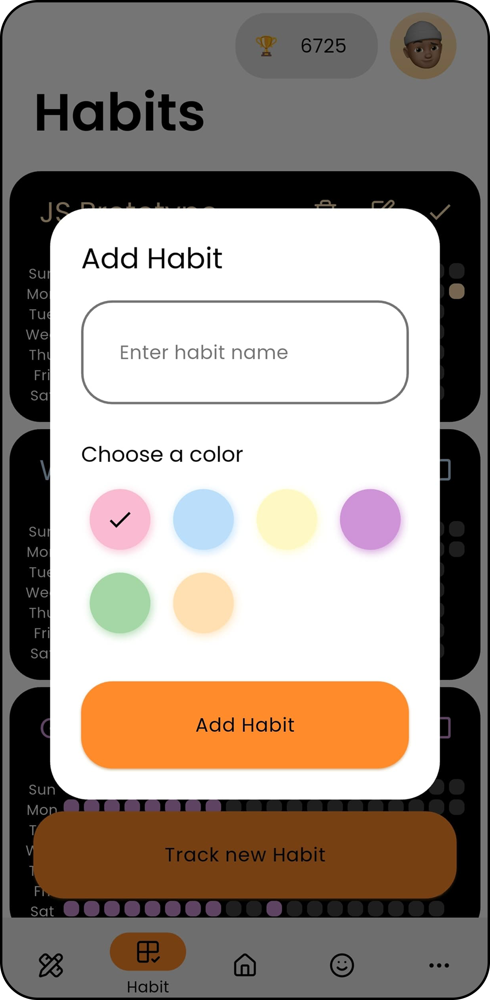

# Zenunni – AI Scheduler & Student Assistant App

<p align="center">
  
</p><br/>
Zenunni is an all-in-one productivity app designed for college students and working professionals. It combines task management, AI assistance, habit and mood tracking, Pomodoro focus tools, and a chatbot named "Unni".


## ✨ Features
- 🔔 Smart Task Manager with Priorities & Recurrence
- ⏱️ Pomodoro Timer
- 🤖 AI Chatbot (Gemini API)
- 📊 Mood & Habit Tracker
- 🌙 Dark & Light Theme Modes
- 🔐 Firebase Auth & Firestore DB

## 🧠 Tech Stack
- Flutter + Dart
- Firebase (Auth, Firestore, Storage)
- Riverpod for State Management
- Gemini API for AI Chatbot

## 📸 Screenshots
<p align="center">
  
  
  
 
 
 
 
 
 
 
</p>


## 🔧 Installation Guide for Zenunni

### 1. Clone the Repo
```bash
git clone https://github.com/jydv402/ZenUnni.git
cd ZenUnni
```

### 2. Install Dependencies
```bash
flutter pub get
```

### 3. Setup Firebase
- Use `flutterfire configure` to generate `firebase_options.dart`
- Add `.env` with your keys

### 4. Run App
```bash
flutter run
```

## 🧱 Zenunni Architecture

### The ```lib/``` tree 🌳
```
.
├── auth_pages
│   ├── auth_page.dart
│   ├── email_verif_page.dart
│   ├── login_page.dart
│   ├── pass_reset.dart
│   ├── register_page.dart
│   └── username.dart
├── components
│   ├── confirm_box.dart
│   ├── fab_button.dart
│   ├── headsup_noti.dart
│   ├── loading_anims.dart
│   ├── scorecard.dart
│   ├── toggle_pass_button.dart
│   └── toggle_theme_auth.dart
├── consts
│   ├── avtlist.dart
│   └── moodlist.dart
├── firebase_options.dart
├── main.dart
├── models
│   ├── habit_model.dart
│   ├── schedule_model.dart
│   ├── search_model.dart
│   ├── todo_model.dart
│   └── user_model.dart
├── notification
│   └── notif.dart
├── screens
│   ├── add_todo.dart
│   ├── chat_page.dart
│   ├── currmood.dart
│   ├── desc.dart
│   ├── habit.dart
│   ├── home.dart
│   ├── leaderboard.dart
│   ├── mood.dart
│   ├── nav.dart
│   ├── note.dart
│   ├── notes_list.dart
│   ├── pomodoro_page.dart
│   ├── profile.dart
│   ├── sched_edit.dart
│   └── task_switch.dart
├── services
│   ├── ai_serv.dart
│   ├── appclrs_serv.dart
│   ├── chat_serv.dart
│   ├── desc_serv.dart
│   ├── gamify_serve.dart
│   ├── habit_serv.dart
│   ├── mood_serv.dart
│   ├── nav_serv.dart
│   ├── notes_serv.dart
│   ├── pomodoro_serve.dart
│   ├── schedule_serv.dart
│   ├── search_serv.dart
│   ├── theme_serv.dart
│   ├── todo_serv.dart
│   └── user_serv.dart
├── theme
│   ├── text_theme.dart
│   └── theme.dart
├── utils
│   ├── color_utils.dart
│   └── state_invalidator.dart
└── zen_barrel.dart
```

### 🔨 Folder Structure (lib/)
- `auth_pages/`: Registration, login, verification
- `components/`: UI widgets (toasts, dialogs)
- `models/`: Data models (TodoModel, UserModel)
- `screens/`: Main app screens (Chat, Home, Pomodoro)
- `services/`: Business logic + Firestore interaction
- `theme/`: Light & dark themes
- `utils/`: Helper functions
- `zen_barrel.dart`: Barrel file to re-export all

### 🧠 State Management
- Using Riverpod (`flutter_riverpod`) for global states like theme, user info, task list

### ☁️ Firebase Services
- Auth for login/register/email verification
- Firestore for storing user data and tasks
- Firebase Cloud Messaging and Local Notifications

 
## 🙌 Contribute to Zenunni

Thanks for your interest! Follow these steps:

### 1. Fork and Clone
```bash
git clone https://github.com/jydv402/ZenUnni.git
```

### 2. Create Branch
```bash
git checkout -b feature/your-feature-name
```

### 3. Make Changes
Push commits with meaningful messages.

### 4. Create Pull Request

## Guidelines
- Use clear variable names
- Follow existing UI patterns
- Test before pushing
---

© 2025 Team Zenunni
